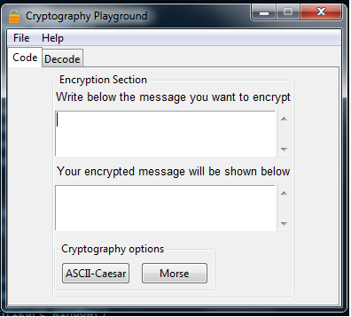
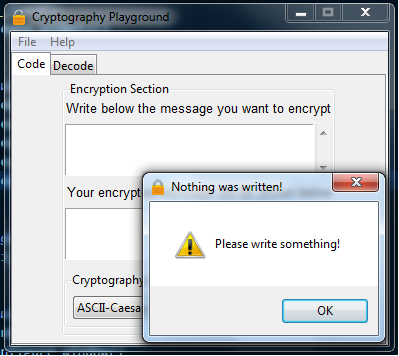
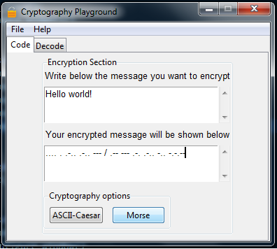
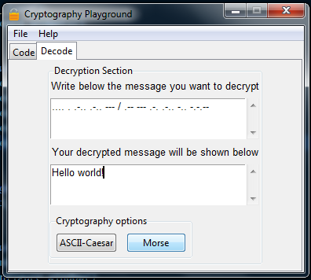
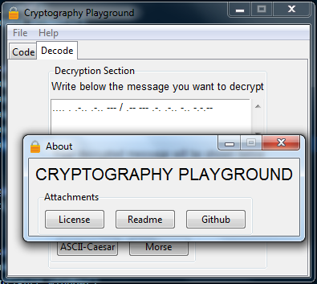
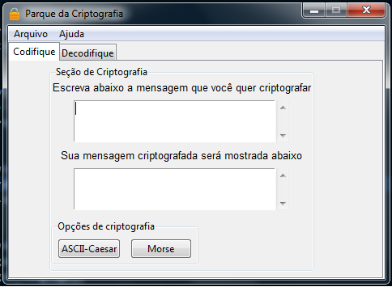

# CryptographyPlayground

Cryptography Playground allows you to play a little bit encrypting and decrypting messages based in some cryptography algorithms(Caesar, Morse).

## Notes 

* For the Caesar Cipher, i actually implemented a variation of it, that uses the ascii table for the character displacement instead of the usual alphabet letters. The reason i did that, it's because i thought it's a better approach, since in this way numbers and characters not in the alphabet are also changed in the encrypted message.

## Motivation

I just want to learn how to make GUIs with tkinter.

## Prerequisites

* Python 3.x

## Installing

* Just git clone it : `git clone https://github.com/GabrielAlves/CryptographyPlayground.git`

## How to use

* Run the file *cryptography_playground.py* and the GUI will be called

## Screenshots

The GUI when you run *cryptography_playground.py*.

A warning to write something just in case the user try to encrypt/decrypt nothing.

An example showing morse encryption.

An example showing morse decryption.

The about window within help menu.

An example showing the GUI in portuguese. It's possible to change the language if it's defined in the *i18n* folder.

